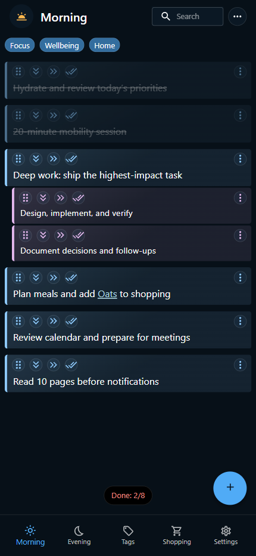

# Routinely

Routinely is a mobile-first TypeScript React progressive web app for organizing morning and evening routines, conditionally surfacing tasks with tags, and synchronizing personal data through Firebase Authentication and Cloud Firestore.

## Links

- [Live app](https://routinely-app-d7d9c.web.app)

## Preview

[](https://routinely-app-d7d9c.web.app)

## Tech Stack

| Area                    | Technology                                       |
| ----------------------- | ------------------------------------------------ |
| Frontend                | React 19, TypeScript 5.9, Vite 8, React Router 7 |
| UI                      | Material UI 7, Emotion                           |
| Authentication and data | Firebase Authentication, Cloud Firestore         |
| PWA                     | `vite-plugin-pwa`, Workbox, Web App Manifest     |
| Testing                 | Vitest, jsdom                                    |
| Quality                 | Strict TypeScript, ESLint 9, Prettier            |
| Delivery                | GitHub Actions CI/CD, Firebase Hosting           |
| Repository              | npm workspaces with shared types and utilities   |

## Key Features

- Separate morning and evening routines with completion tracking.
- Nested tasks up to three levels deep, with inline editing and keyboard shortcuts.
- Tag rules that show or hide tasks based on the user's current context.
- Pointer-based drag-and-drop ordering and swipe actions designed for touch interfaces.
- Searchable routines, tags, and shopping items with saved scroll positions.
- A shopping list that can receive items directly from marked phrases in routine tasks.
- Offline-first access through service-worker asset caching and Firestore's persistent local cache.
- Email/password, Google, and anonymous authentication with protected application routes.
- Real-time per-user Firestore synchronization with persistent multi-tab local caching.

## Getting Started

### Prerequisites

- Node.js `25.9.0`
- npm

### Installation

```bash
git clone https://github.com/SaoodCS/Routinely-App.git
cd Routinely-App
npm ci
```

### Run locally

```bash
npm run dev:frontend
```

Vite serves the app on `http://localhost:5173` by default.

The frontend uses the Firebase web configuration committed in [`apps/frontend/src/firebase/config.ts`](apps/frontend/src/firebase/config.ts), so local sessions connect to the configured Firebase project.

### Verify a change

```bash
npm run lint-typecheck
npm run test:frontend
npm run build:frontend
```

## Available Scripts

| Command                   | Description                                                   |
| ------------------------- | ------------------------------------------------------------- |
| `npm run dev:frontend`    | Starts the Vite development server                            |
| `npm run build:frontend`  | Type-checks and builds the frontend                           |
| `npm run test:frontend`   | Runs the frontend test suite once                             |
| `npm run lint`            | Runs ESLint across the monorepo                               |
| `npm run typecheck`       | Type-checks every workspace that provides a type-check script |
| `npm run lint-typecheck`  | Runs linting and workspace type checks together               |
| `npm run format`          | Formats supported app, package, and root files                |
| `npm run deploy:frontend` | Builds and deploys the frontend to Firebase Hosting           |

The deploy command requires access to the configured Firebase project.

## Architecture

```text
apps/
  frontend/     React application, routes, UI, Firebase, and PWA configuration
  backend/      Reserved Node.js workspace
packages/
  types/        Shared domain and persistence types
  utils/        Shared task, tag, shopping, and Firestore utilities
.github/
  workflows/    Frontend CI/CD pipeline
```

The frontend is organized around route-level features for routines, tags, the shopping list, authentication, and settings. React context providers expose authentication and Firestore state, while shared workspace packages keep domain models and data-path utilities consistent.

Routing is centralized with typed path constants, protected/public-only route guards, and route metadata that controls the shared header and bottom navigation. Reusable interaction components handle drag-and-drop, swipe actions, inline editing, text formatting, loading states, and URL-backed search.

## PWA Support

- A generated manifest configures a standalone productivity app with standard and maskable icons.
- The Workbox service worker registers immediately and uses automatic updates.
- Apple touch icons and splash-screen assets are generated during the production build.
- Firebase Firestore uses persistent local caching with multi-tab coordination.
- An in-app dialog provides installation guidance when the app is not running in standalone mode.

The current implementation supports cached application assets and persisted Firestore data after initial use. It does not yet provide a dedicated offline-status or conflict-resolution interface.

## Testing and Quality

The frontend currently has 35 Vitest cases across 11 test files. Coverage focuses on reusable components and hooks, including drag-and-drop behavior, swipe handling, editable fields, search parameters, PWA guidance, storage synchronization, scroll restoration, and scroll-aware UI.

Quality controls include:

- Strict TypeScript settings shared across workspaces.
- Type-aware ESLint rules, React Hooks checks, import validation, unused-code detection, and selected security rules.
- Prettier integration for consistent formatting.
- A GitHub Actions workflow that runs installation, linting, type checking, frontend tests, a production build, and Firebase deployment on pushes to `main`.

## Deployment

The production frontend is hosted on Firebase Hosting at [routinely-app-d7d9c.web.app](https://routinely-app-d7d9c.web.app). Firebase rewrites all application routes to `index.html` so React Router can handle client-side navigation.

The CI/CD workflow builds `apps/frontend/dist` and deploys it to the live Firebase channel after all configured quality checks pass.

## Engineering Decisions

- **Workspace boundaries:** npm workspaces separate the deployable frontend from reusable types and utilities while leaving room for a future backend.
- **Typed persistence paths:** shared Firestore path definitions connect domain types to per-user documents and reduce duplicated string paths.
- **Realtime client architecture:** snapshot listeners keep authenticated sessions synchronized without a custom API layer.
- **Portable interactions:** drag-and-drop and swipe components use pointer events directly rather than adding dedicated interaction dependencies.
- **Route-driven layout:** route metadata keeps navigation and header behavior close to each feature's routing definition.

## Known Limitations and Roadmap

- Expand testing to authenticated routes, Firestore integration, and end-to-end user workflows.
- Add explicit offline, reconnecting, and synchronization-conflict states.
